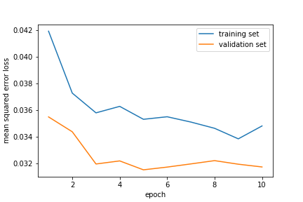

# Behavioral Cloning Project Writeup

The goals / steps of this project are the following:

- Use the simulator to collect data of good driving behavior
- Build, a convolution neural network in Keras that predicts steering angles from images
- Train and validate the model with a training and validation set
- Test that the model successfully drives around track one without leaving the road
- Summarize the results with a written report

You can find a recording of my test run on track one at this youtube link:
https://www.youtube.com/watch?v=ZXhmjFPRmho&t=1s

***

#### 1. An appropriate model architecture has been employed

My model consists of a convolution neural network that is based off of the Nividia architecture found at:
https://devblogs.nvidia.com/parallelforall/deep-learning-self-driving-cars/

The model includes RELU layers to introduce nonlinearity that can be found as parameters passed through my "Convolution2D" and "Activation" calls and (code line 92-125), and the data is normalized in the model using a Keras lambda layer (code line 18).

| Layer (type)   | Output Shape  |
|----------------|---------------|
| Lambda         | (160, 320, 3) |
| Convolution2D  | (24, 5, 5)    |
| Dropout        | (0.2)         |
| Convolution2D  | (36, 5, 5)    |
| Dropout        | (0.2)         |
| Convolution2D  | (48, 5, 5)    |
| Dropout        | (0.2)         |
| Convolution2D  | (64, 3, 3)    |
| Dropout        | (0.2)         |
| Convolution2D  | (64, 3, 3)    |
| Dropout        | (0.2)         |
| Flatten        | (576)         |
| Dense          | (100)         |
| Dropout        | (0.5)         |
| Dense          | (50)          |
| Dense          | (10)          |
| Dropout        | (0.5)         |
| Dense          | (1)           |

#### 2. Attempts to reduce overfitting in the model

The model contains dropout layers in order to reduce overfitting (model.py lines 93-126).

The model was trained and validated on different data sets to ensure that the model was not overfitting (code line 75-80). After having seen the car drive into the lake, into the corners near the start of the bridge, and onto the dirt road after the bridge I added more dropout to my model. This made it a little better, but the car was still making mistakes. This is when I went back to training mode and recorded the correct behavior the car should be making at each section of the track where it was having trouble. By adding this extra training data the car was finally able to drive correctly around the whole track.

The model was tested by running it through the simulator and ensuring that the vehicle could stay on the track. The video can be found at: https://www.youtube.com/watch?v=ZXhmjFPRmho&t=1s

#### 3. Model parameter tuning

The model used an adam optimizer, so the learning rate was not tuned manually (model.py line 134).

#### 4. Appropriate training data

Training data was chosen to keep the vehicle driving on the road. I used a combination of center lane driving, recovering from the left and right sides of the road to ensure the car would drive safely in the simulator. I also chose to drive the car around the track backwards to give it more experience in handling right turns. You can see my training data in the 'data' folder. As noted above, I created more training data for sections of the track where the car was having trouble.

For details about how I created the training data, see the next section.

***

## Model Architecture and Training Strategy

#### 1. Solution Design Approach

The overall strategy for deriving a model architecture was to create one that could scale to accept large amounts of training data, and generalize very well what "safe driving" looks like. Being able to handle large amounts of training data was very important to me because I know that in the real-world self-driving car engineers drive thousands of miles collecting data for their models.

My first step was to use a convolution neural network model similar to the Nividia's. I thought this model might be appropriate because they have there model very well documented on their page at: https://devblogs.nvidia.com/parallelforall/deep-learning-self-driving-cars/

In order to gage how well the model was working, I split my image and steering angle data into a training and validation set. I found that my first model had a low mean squared error on the training set but a high mean squared error on the validation set. This implied that the model was overfitting.

To combat the overfitting, I modified the model so that there were many more dropout layers.

The final step was to run the simulator to see how well the car was driving around track one. There were a few spots where the vehicle fell off the track all happened right before and right after the bridge. It would drive into the corner near the start of the bridge. It would also drive onto the dirt road after the bridge. Lastly, it would drive into the lake after avoiding the dirt road after the bridge.

to improve the driving behavior in these cases, I recorded more training data at these sections of the track especially.

At the end of the process, the vehicle is able to drive autonomously around the track without leaving the road.

#### 2. Final Model Architecture

The final model architecture (model.py lines 84-129) consisted of a convolution neural network with the following layers and layer sizes

Here is a visualization of the architecture:

| Layer (type)   | Output Shape  |
|----------------|---------------|
| Lambda         | (160, 320, 3) |
| Convolution2D  | (24, 5, 5)    |
| Dropout        | (0.2)         |
| Convolution2D  | (36, 5, 5)    |
| Dropout        | (0.2)         |
| Convolution2D  | (48, 5, 5)    |
| Dropout        | (0.2)         |
| Convolution2D  | (64, 3, 3)    |
| Dropout        | (0.2)         |
| Convolution2D  | (64, 3, 3)    |
| Dropout        | (0.2)         |
| Flatten        | (576)         |
| Dense          | (100)         |
| Dropout        | (0.5)         |
| Dense          | (50)          |
| Dense          | (10)          |
| Dropout        | (0.5)         |
| Dense          | (1)           |

#### 3. Creation of the Training Set & Training Process

To capture good driving behavior, I first recorded two laps on track one using center lane driving. Here is an example image of center lane driving:

I then recorded the vehicle recovering from the left side and right sides of the road back to center so that the vehicle would learn to correct itself on its own. Then I repeated this process on track two in order to get more data points.

After the collection process, I had 14,423 number of data points. I then preprocessed this data by randomly shuffling the data set and put 20% of the data into a validation set.

I used this training data for training the model. The validation set helped determine if the model was over or under fitting. The ideal number of epochs was 9 as evidenced by the training history dropout img you can see below:

